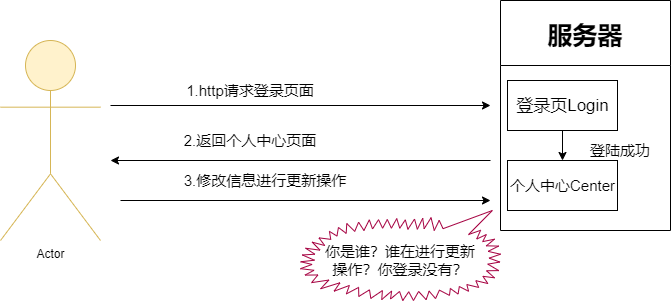

### 什么是Session？

​		Session：在计算机中，尤其是在网络应用中，称为“会话控制”。Session对象存储特定用户会话所需的属性及配置信息。这样，当用户在应用程序的Web页之间跳转时，存储在Session对象中的变量将不会丢失，而是在整个用户会话中一直存在下去。当用户请求来自应用程序的 Web页时，如果该用户还没有会话，则Web服务器将自动创建一个 Session对象。当会话过期或被放弃后，服务器将终止该会话。Session 对象最常见的一个用法就是存储用户的首选项。

### 为什么要使用Session？

​	    我们在开发中一定做过登录校验功能。如下图所示：



* 第一步：我们通过登录页面进行系统登录。
* 第二步：登录成功系统服务返回给我们个人中心的页面。
* 第三不：修改信息进行保存操作。

​        上面操作会出现以下问题，可能出现在没有登录的情况下直接访问个人中心页面进行信息修改。为什么了？因为Http协议是无状态，多个http请求是相互不干扰，不联系，做到了自己是谁就只是谁。页面登录成功后跳转到个人中心页面，个人中心页面根本就不知道你登录了没有。

​		怎么解决这个问题了，我们可以把登录状态存入数据库中，每个页面请求都去查一次数据库，判读是否有登录。但是这样的做的后果就是增加数据库的压力。这样就出现了客户端存储信息Cookie。cookie可以把少量的信息存储在浏览器中，而且一个域名中的反问处于同一个作用局。我们就可以登录成功后向客户端写入登录成功的cookie信息，客户端每次请求带上cookie去服务器验证。

​		但是由于cookie 是存在客户端，而且它本身存储的尺寸大小也有限，最关键是用户可以是可见的，并且可以随意的修改，很不安全。那如何又要安全，又可以方便的全局读取信息呢？于是，这个时候，一种新的存储会话机制：session 诞生了。这样就能让多个http请求产生关系。

### Session从哪里来又是怎么产生的？

* 从哪里来

  ​		前面提到要让服务器知道两个http请求是否有关系就得记下它们的关系，所以肯定是从服务器来啊。服务器哪里？现在web开发都是使用Servlet容器开发，也就是通过Tomcat得到也就通过Servlet的HttpSession类得到。

* 怎么产生

  ​		并不是通过客户端发起请求就会产生，然而是直到服务端的程序调用`HttpServletRequest.getSession(true)`这个方法才会产生Session。

  ​		注意如果JSP没有显示的使用 `<% @page session="false"%> `关闭session，则JSP文件在编译成Servlet时将会自动加上这样一条语句` HttpSession session = HttpServletRequest.getSession(true)`这也是JSP中隐含的 session对象的来历。

  ​		访问*.html的静态资源因为不会被编译为Servlet，也就不涉及session的问题。

### Session存储的位置

​		session 是存储在服务器端的内存中。不过session可以通过特殊的方式做持久化管理。由于session会消耗内存资源，因此，如果不打算使用session，应该在所有的JSP中关闭它。客户端存储在Cookie中。


​		当浏览器禁用Cookie存储时，我们可以通过以下方法。

```java
//用于对sendRedirect方法后的url地址进行重写。
response.encodeRedirectURL(java.lang.String url) 
//用于对表单action和超链接的url地址进行重写
response.encodeURL(java.lang.String url)
```


### Sessions删除的时间

* 到达设定的过期时间。可以在web.xml进行配置。

  ```xml
  <session-config>
      <session-timeout>6000</session-timeout>
   </session-config>
  ```

* 程序调用`HttpSession.invalidate()`。
* 程序关闭。